# RESEARCH METHODS & DATA ANALYSIS FOR INFORMATION PROFESSIONALS

- [RESEARCH METHODS & DATA ANALYSIS FOR INFORMATION PROFESSIONALS](#research-methods--data-analysis-for-information-professionals)
  - [01 - Introduction to Research](#01---introduction-to-research)
    - [Objectives](#objectives)
    - [Methods of Acquiring Knowledge](#methods-of-acquiring-knowledge)
    - [Characteristics of Scientific Research](#characteristics-of-scientific-research)
    - [Roles of the Scientist](#roles-of-the-scientist)
    - [Objectives of Scientific Research](#objectives-of-scientific-research)
  - [02 - Research Paradigms](#02---research-paradigms)
    - [A Research Paradigm](#a-research-paradigm)
    - [Positivism](#positivism)
    - [Interpretivism](#interpretivism)
    - [Deductive Approach](#deductive-approach)
    - [Inductive Approach](#inductive-approach)
    - [Quantitative Research](#quantitative-research)
    - [Experimental Research](#experimental-research)
    - [Experimental Research Pro & Cons](#experimental-research-pro--cons)
    - [Experimental Research Forms](#experimental-research-forms)
    - [Non-experimental Quantitative Research](#non-experimental-quantitative-research)
    - [Qualitative Research](#qualitative-research)
    - [Methods of Data Collection](#methods-of-data-collection)
    - [Research Methods and Strategies](#research-methods-and-strategies)
    - [The Research Onion](#the-research-onion)
  - [03 - Formulating Research Questions](#03---formulating-research-questions)
    - [Sources of Research Ideas](#sources-of-research-ideas)
    - [Non-researchable Ideas](#non-researchable-ideas)
    - [Review of Literature](#review-of-literature)
    - [Research Problem & Purpose](#research-problem--purpose)
    - [Quantitative Research Question](#quantitative-research-question)
    - [Bad Research Questions](#bad-research-questions)
    - [Hypothesis](#hypothesis)
    - [Correlation vs Causation](#correlation-vs-causation)
    - [Qualitative Research Question](#qualitative-research-question)
  - [04 - Measurement and Sampling](#04---measurement-and-sampling)
    - [Measurement](#measurement)
    - [Criteria for Good Measurement](#criteria-for-good-measurement)
    - [Reliability](#reliability)
    - [Validity](#validity)
    - [Content-related Validity](#content-related-validity)
    - [Criterion-related Validity](#criterion-related-validity)
    - [Reliability vs Validity](#reliability-vs-validity)
    - [Types of Research Validity](#types-of-research-validity)
    - [Threats to Construct Validity](#threats-to-construct-validity)
    - [Threats to Internal Validity](#threats-to-internal-validity)
    - [External Validity](#external-validity)
    - [Internal vs External Validity](#internal-vs-external-validity)
    - [Terminology in Sampling](#terminology-in-sampling)
    - [Random Sampling Techniques](#random-sampling-techniques)
    - [Nonrandom Sampling Techniques](#nonrandom-sampling-techniques)
    - [Random Selection vs Assignment](#random-selection-vs-assignment)
    - [Sample Size](#sample-size)
    - [Sampling in Qualitative Research](#sampling-in-qualitative-research)
  - [05 - Survey Research](#05---survey-research)
    - [Introduction to Survey Research](#introduction-to-survey-research)
    - [Survey Research Design](#survey-research-design)
    - [Survey Data Collection Method](#survey-data-collection-method)
    - [Constructing Survey Instrument](#constructing-survey-instrument)
  - [06 - Experimental Research](#06---experimental-research)
    - [Between- & Within-Participants Designs](#between---within-participants-designs)
    - [Factorial Designs](#factorial-designs)
    - [Control Techniques At the Start](#control-techniques-at-the-start)
    - [Counterbalancing](#counterbalancing)
    - [Minimizing Participants Effects](#minimizing-participants-effects)
    - [Minimizing Experimenter Effects](#minimizing-experimenter-effects)
    - [Participants Recruitment](#participants-recruitment)
    - [Pilot Study](#pilot-study)
  - [07 - Observational Research](#07---observational-research)
    - [Qualitative Research Characteristics](#qualitative-research-characteristics)
    - [Qualitative Research Validity](#qualitative-research-validity)
    - [Qualitative Research Methods](#qualitative-research-methods)
    - [Content Analysis](#content-analysis)
    - [Steps in Content Analysis](#steps-in-content-analysis)
  - [08 - Interviews and Focus Groups](#08---interviews-and-focus-groups)
    - [Interviews](#interviews)
    - [Types of Interviews](#types-of-interviews)
    - [Steps involved in Interviews](#steps-involved-in-interviews)
    - [Focus Groups](#focus-groups)
  - [09 - Data Analysis](#09---data-analysis)
    - [Introduction to Statistics](#introduction-to-statistics)
    - [Measures of Central Tendency](#measures-of-central-tendency)
    - [Measures of Variability](#measures-of-variability)
    - [Distribution](#distribution)
    - [Relationships Among Variables](#relationships-among-variables)
    - [Descriptive vs Inferential Stats](#descriptive-vs-inferential-stats)
    - [T-test](#t-test)
    - [ANOVA](#anova)
    - [Post-hoc Tests in ANOVA](#post-hoc-tests-in-anova)
    - [Repeated Measures ANOVA](#repeated-measures-anova)
    - [Post-hoc Tests in rm ANOVA](#post-hoc-tests-in-rm-anova)
    - [ANCOVA](#ancova)
    - [2-Way ANOVA](#2-way-anova)
    - [Multiple Regression](#multiple-regression)
    - [Chi-Square Test](#chi-square-test)
  - [10 - Research Ethics](#10---research-ethics)
    - [Areas of Ethical Concerns](#areas-of-ethical-concerns)
    - [Ethical Guidelines](#ethical-guidelines)
    - [Ethical Issues in Research](#ethical-issues-in-research)

## 01 - Introduction to Research

### Objectives

- To understand concepts, issues and techniques related to research for information professionals.
- To formulate clear research questions and identify an appropriate research design with the accompanying approach for data analysis.
- To carry out an empirical research project which is feasible and rigorous.

### Methods of Acquiring Knowledge

- Intuition  
  - Thinking that you know without reason
- Authority
  - Accepting from a highly respected source
- Rationalism
  - Using reasoning
- Empiricism
  - Using experience and observation

### Characteristics of Scientific Research

- Control
  - Influence of extraneous variables must be eliminated
  - Control condition is used to rule out the placebo effect
- Operationalism
  - Each concept must be defined by operations that measures it
- Replication
  - Results of a study must be reproducible in another study

### Roles of the Scientist

- Curiosity
  - Asking questions: What? When? Where? Why? How?
- Patience
  - Research involves a prolonged period of painstaking efforts
- Objectivity
  - Personal biases and opinions should be removed or minimized
- Change
  - Accepting change as part of the research process

### Objectives of Scientific Research
- Descriptive
  - Accurate portrayal of a situation or phenomenon
- Explanation
  - Knowledge of why a situation or phenomenon occurs
- Prediction
  - Anticipation of situation or phenomenon before it occurs
- Control
  - Manipulation of the conditions that lead to the situation or
  phenomenon

## 02 - Research Paradigms

### A Research Paradigm

- Definition
  - A set of beliefs about how research problems should be understood
  and addressed
  - Or simply a way of looking at a research issue
- Elements
  - Ontology: what is reality?
  - Epistemology: what is knowledge?
  - Methodology: what type of data is needed and why?
  - Method: what tools are most appropriate to collect data?

### Positivism

- Assumptions
  - Reality is context-free; Researchers are objective observers
  - Laws that govern social phenomenon can be formulated through
  scientific methods such as experimentation
- General focus
  - To uncover trends and patterns rather than on individuals
- Criticisms
  - Objective and scientific methods are appropriate for studying natural objects but less so for social phenomenon
  - Laws governing individuals and their relationships are complex

### Interpretivism

- Assumptions
  - Reality is dependent on our sense
  - Truth and reality are socially constructed
- General Focus
  - To gain insight into the lives of individuals and why they act they
  way they do
- Criticisms
  - It lacks objectivity
  - It does not yield generalizable theories

### Deductive Approach

- Purpose
  - To test a theory
- Emphasis
  - To confirm causality
- Sequence of Steps
  - Hypothesis → Observation → Confirmation
- Line of Reasoning
  - General principle → Special case

### Inductive Approach

- Purpose
  - To generate a new theory
- Emphasis
  - To explore a new phenomenon or to view from a new perspective
- Sequence of Steps
  - Observation → Finding patterns → Theory
- Line of Reasoning
  - Special case → General principle

### Quantitative Research

- Definition
  - The collection and analysis of large amount of quantifiable data to make predictions, establish causal relationships which are generalizable
- Variables
  - Independent variable (IV): the cause or predictor
  - Dependent variable (DV): the effect or outcome
  - Mediating variable: occurs between two variables in a causal chain
  - Moderating variable: specifies how relationship between two variables can change
    - Mediating variable is one step in the casual chain, while moderating variable is a weaker cause than an IV
  - Extraneous variable: not independent variables but could affect the results of the study
- Illustration
  - 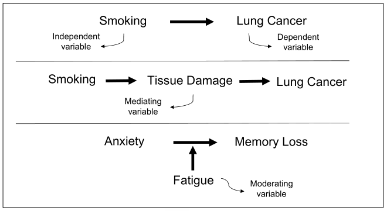

### Experimental Research

- Causation
  - Relationship: IV and DV must be related
  - Temporal order: changes in IV must precede changes in DV
  - No alternative explanation condition
- Characteristics
  - Objective observation: strive to ensure impartiality and freedom from biases
  - Manipulation:  deliberately changing the IV to trigger the outcome
  - Control: only variations are the experimental conditions

### Experimental Research Pro & Cons

- Advantages
  - The best method to identify causal relationships
  - Researcher is able to manipulate one or more IV
  - Researcher has control over extraneous variables
- Disadvantages
  - Cannot test non-manipulated variables
  - The experimental setting is artificial
  - Inadequate because humans are not manipulable mechanistic
  objects

### Experimental Research Forms

- Field experiment
  - Conducted in a real-life setting
  - E.g. To find out if a customer’s attire affects the time it takes to receive attention from the sales assistant in a store
- Laboratory experiment
  - Conducted in a laboratory where extraneous variables can be controlled
- Internet experiment
  - Conducted over the internet
  - E.g. To compare variables influencing the perception of female attractiveness conducted over the Internet and in the controlled conditions of a laboratory

### Non-experimental Quantitative Research
- Definition
  - Quantitative research which does not involve any manipulation of the independent variable
- Forms
  - Correlational study: measuring two variables and their relationship (could be confounded by the “third variable problem”; for more complex relationships, path analysis could be used to identify direct and indirect effects)
  - Natural manipulation research: the IV could be described as a contrast between treatment and control condition. (e.g. to investigate the relationship between divorce and psychological functioning of adults)
  - Cross-sectional study: conducted at a single time period
  - Longitudinal study: collecting data over a period of time

### Qualitative Research

- Definition
  - The collection and analysis of multiple types of subjective data to investigate a phenomenon in its natural setting
- Characteristics
  - Interpretive: seek to understand the insider’s view
  - Triangulation: use multiple data sources and methods to cross-check
  - Natural setting: to gain an empathic understanding of the phenomenon
- Strengths and weaknesses
  - Deeper understanding of a phenomenon
  - Supports logic of discovery
  - Results may not be generalizable

### Methods of Data Collection

- Tests
  - Designed to measure personality, achievements and performance
  - Strengths include supporting comparability across research populations and facilitating data analysis
  - Weaknesses include high costs and potential biases to some groups of people
- Questionnaires
  - Self-reported instruments to capture opinions and perceptions
  - Strengths include low cost and ease of data analysis
  - Weaknesses include potentially low response rate and the need for validation

- Interviews
  - Interviewees are asked a series of questions
  - Strengths include the possibility of probing further and uncovering in-depth information
  - Weaknesses include reactive effect (interviews showing social desirability bias) and investigator effect (interviewers showing biases and poor interviewing skills)
- Focus Groups
  - Interviews conducted with a small and homogenous group
  - Strengths include exploration of ideas and concepts
  - Weaknesses include high cost and the possibility being dominated by a few participants

- Observations
  - Naturalistic observation: done in a real-world setting
  - Laboratory observation: done in a controlled environment
  - Time-interval sampling: observe at preselected time interval
  - Event sampling:  observe each time an event occurs
  - Level of involvement: Complete observer, observer-as-participant, participant-as-observer, complete participant
- Existing or Secondary Data
  - Documents: written for private purposes
  - Physical data: materials created or left behind that are of interest
  - Archived research data: collected by other researchers

### Research Methods and Strategies

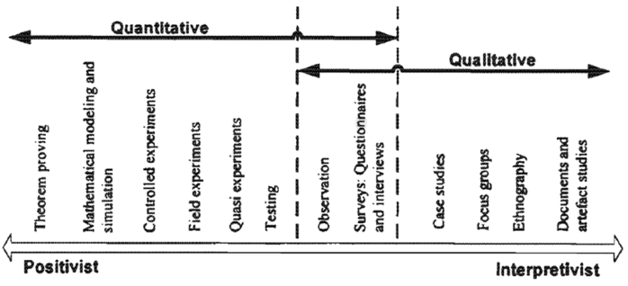

### The Research Onion

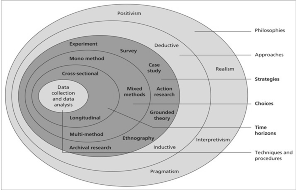

## 03 - Formulating Research Questions

### Sources of Research Ideas

- Everyday life
  - Questions arise from interpersonal interactions and experiences
- Practical Issues
  - Issues in workplace and society demand answers
- Theory
  - An existing theory can be tested in an entirely new context
- Past Research
  - Research conducted previously can inspire new ideas

### Non-researchable Ideas

- No possibility of empirical investigation
  - Issues on morality and religion are outside the scope of scientific inquiry (e.g. Does God exist?)
  - Philosophical questions that cannot be subjected to empirical analysis (e.g. Are humans born good or evil?)
  - Rhetorical questions that do not expect an answer (e.g. How can we live without love?)

### Review of Literature

- Purpose
  - To know the extent to which the problem has been addressed
  - To be informed in the choice of research design
  - To be aware of the methodological challenges
  - To identify the need for special equipment
- Resources
  - Journal articles
  - Conference papers
  - Books
  - Internet sources

### Research Problem & Purpose

- Grounded in theory or prior research
  - Ideally relies on a theory or prior research as its starting point
- Addresses one or more research gaps
  - Seeks to fill the gap(s) where current understanding is lacking
- Holds theoretical and practical significance
  - Makes a meaningful contribution to theory and practice
- Generates research questions
  - It is expressible as questions to facilitate scientific inquiry

### Quantitative Research Question

- Builds on and adds to past research
  - Serves to extend what has been done previously
  - Adds to knowledge and bears practical implications
- Specific and clear
  - Expresses key ideas specifically and clearly
- Empirically verifiable
  - Responses to the question must be verifiable
- Feasible
  - The question can be addressed within a reasonable time-frame

### Bad Research Questions

- Broadly framed questions
  - Broadly framed question on an ill-defined issue cannot be systematically addressed
  - E.g. Are smartphones bad for schools?
- How-to questions
  - Questions that involve step-by-step procedures are not research-related
  - E.g. How to fix a punctured tire?
- Questions with trivial answers
  - Questions involving counting or listing are not research-worthy
  - E.g. What many student have been enrolled in the University in 2020?

### Hypothesis

- Definition
  - Statement about the relationship between two or more variables which can be tested
  - Must be capable of being rejected or confirmed
- Basis
  - Formulated based on observation, informed reasoning and past research
- Research and Null Hypotheses
  - Research hypothesis: an assertion about the relationship among variables
  - Null hypothesis: a statement about the non-relationship among the variables
    - Null hypothesis (H0) is the currently accepted hypothesis, and what to do is trying to reject it by proving it is false, or its negative proposition (H1) is true.

### Correlation vs Causation

- Correlation
  - The extension to which two variables are linearly related
  - E.g. “Ice-cream sales is correlated to incidents of sunburn”
- Causation
  - An indication of an event causing an outcome
  - E.g. “Smoking causes lung cancer”
  - Test for causation: 
    1. covariation,
    2. temporal precedence,
    3. relationship is nonspurious (not caused by a third variable).

### Qualitative Research Question

- A central question followed by sub-questions
  - Focuses on a single phenomenon or concept
  - Uses open-ended questions such as “how” and “why”
  - Specifies the participants and the research site
- Example
  - What are the experiences of working adults who enrolled in a full-time master’s program in an autonomous university in Singapore?
    - Why do working adults decide to enroll in a full-time masters’ program?
    - How do these adults describe their re-entry experiences?
    - How does returning to the university change the lives of these adults?

## 04 - Measurement and Sampling

### Measurement

- Construct
  - Sometimes known as concept or variable
  - A generalized idea about a class of objects, attributes
- Operationalization
  - The way a variable is represented and measured
  - Typically grounded in the literature
- Scales of measurement
  - Nominal scale: identifies types or groups (e.g. gender)
  - Ordinal scale: rank-order (distance between ranks unknown)
  - Interval scale: equal distance between adjacent numbers on the scale
  - Ratio scale: has rank order, equal intervals and an absolute zero

### Criteria for Good Measurement

- Reliability
  - The degree to which the measure is error-free and yields consistent results
- Validity
  - The degree to which the measure actually measures what it is intended
- Sensitivity
  - The degree to which the measure can accurately measure the variability in stimuli or responses.

### Reliability

- Test-retest reliability
  - Same results are obtained from a test repeatedly done over time
- Equivalent-forms reliability
  - Same results are obtained from two equivalent tests
- Internal consistency reliability
  - Same results are obtained from different items measuring a variable
  - Cronbach’s alpha is used commonly to confirm internal consistency
- Inter-rater reliability
  - Same results are obtained from different assessors or observes of the same event

### Validity
- Definitions
  - Simple: How accurately a test measures what it seeks to measure
  - Contemporary: the degree to which evidence and theory support the interpretation of test scores entailed by its proposed use
- Implications
  - The test itself is neither valid nor invalid.  Validity concerns the interpretation and uses of the scores
  - Validity is a matter of degree
  - Based on evidence and theory

### Content-related Validity
- Definition
  - The extent to which the test adequately represents the target domain
- Face validity
  - Does not mean the test really measures what was intended; it only appears to be so for the respondents
  - Crude and basic measure of validity
- Homogeneity
  - The degree to which a set of items in a test measures a single construct
  - Can be checked using item-to-total correlation and coefficient alpha

### Criterion-related Validity
- Definition
  - The degree to which scores from a test correlate well with those of other tests
- Predictive validity
  - The degree to which scores from a test can predict a construct measured by another test at a later time (e.g. high scorers of a test at age 12 were found to obtain good grades from the University)
- Concurrent validity
  - The degree to which scores from a test can predict a construct measured by another validated test (e.g. comparability of scores between a new IQ test and an existing IQ test)

- Convergent validity
  - The degree to which scores from a test correlate with scores from other tests of the same construct (e.g. a survey and participant observation are used to measure depression, the scores arising from both are correlated).
- Discriminant validity
  - The degree to which scores from a test is unrelated to the scores of another test measuring a different construct (e.g. scores from a honesty test do not correlate with scores from an intelligence test)
  - Important to include convergent tests to compare against discriminant tests
  - Known-group validity: the degree to which a test is sensitive to the differences between two groups

### Reliability vs Validity

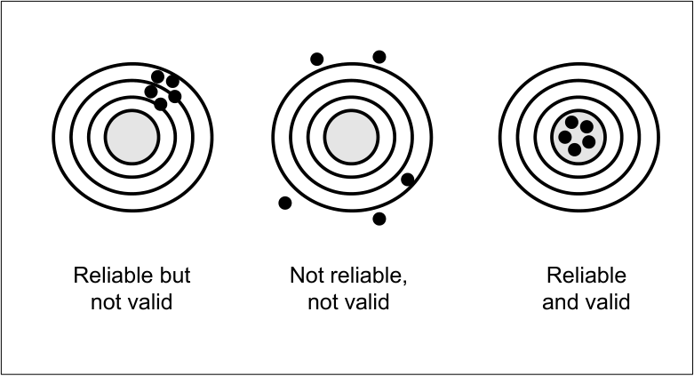

### Types of Research Validity
- Statistical conclusion validity
  - It is the validity of the claim that the IV and DV covary
- Construct validity
  - The degree to which scores on a test adequately measure the construct they are intended to measure
- Internal validity
  - The degree to which DV are attributable to the IV but not other confounding, extraneous variables
- External validity
  - The degree to which results from the study are generalizable beyond the study

### Threats to Construct Validity
- Participant reactivity to the experiment
  - Demand characteristics: participants’ tendencies to respond in a way which they thought was expected of them
  - Positive self-presentation: participants’ tendencies to respond in a way which makes them appear most positive (social desirability bias)
- Experimenter Effects
  - Experimenter expectancies: expectations which cause the experimenter to subconsciously influence the participants
  - Experimenter attributes: 
    - (1) biosocial: experimenter’s age, race, gender; 
    - (2) psychosocial: anxiety level, hostility, authoritarian; 
    - (3) situational factors: whether there was prior experimenter-participant contact

### Threats to Internal Validity
- History
  - An event that affects the outcome other than the treatment
  - Differential history occurs when one group experiences the history event while the other group does not
- Maturation
  - Changes to the individual including aging, learning, fatigue, boredom during the course of the study
- Attrition
  - The loss of participants because they have dropped out
  - Differential attrition occurs when there is a disproportionate loss of participants across groups

- Selection
  - Non-equivalence among groups due to the use of different selection procedures
- Testing
  - Changes in the scores participant obtain when doing the same test a second time
- Regression artifacts
  - Effects that appear to be due to the treatment but are actually due to the natural movement towards the mean
  - Selecting participants with extreme scores could lead to this effect

- Instrumentation
  - Changes that occur over time in the measurement of the DV (e.g. using human observers can lead to instrumentation error)
- Addictive and interactive effects
  - Different threats to internal validity can combine to produce complex biases (e.g. selection-history effect:  groups composed of different kinds of people who respond differently to the same history)

### External Validity
- Population validity
  - The ability to generalize beyond the sample in the study to the entire target population
- Ecological validity
  - The ability to generalize the findings across different environmental conditions
- Temporal validity
  - The ability to generalize the findings across time
  - Seasonal variation: occurs when value of DV varies with season
  - Cyclical variation: refers to systematic up-and-down movement of DV over time

- Treatment variation validity
  - The ability to generalize the results across variations of the treatment (e.g. different level of competencies of experimenter in cognitive- behavior therapy may affect treatment variation validity)
- Outcome validity
  - The ability to generalize the findings across different but related DVs (e.g. a job-training program which helps trainees get a job but not hold on the job does not have outcome validity)

### Internal vs External Validity
- Inverse relationship
  - When external validity is increased, internal validity is reduced and vice versa
  - Important to consider the purpose of the research to determine if internal or external validity is of primary importance

### Terminology in Sampling
- Sample
  - A set of elements from the population (subset of the population)
- Population
  - Full set of elements or people from which you are studying
- Representative Sampling
  - A sample that resembles the population
- Sampling Error
  - Differences between sample values and true population parameter

### Random Sampling Techniques
- Simple Random Sampling
  - A basic equal probability of selection method (EPSEM)
- Stratified Random Sampling
  - Divide the population into mutually exclusive groups and then select a random sample from each group
  - Proportional stratified sampling: sample proportions are made the same as the population proportion on the stratification variable
  - Disproportional stratified sampling: sample proportions are different from the population proportion on the stratification variable

- Cluster Random Sampling
  - A sampling method where clusters (usually naturally occurring groups) are randomly selected
  - One-stage cluster sampling: all individuals in selected clusters are sampled
  - Two-stage cluster sampling:  (1) randomly select a sample of clusters (2) randomly select individuals from these clusters
- Systematic Sampling
  - Determine the sampling interval, k (population divided by sample size)
  - Randomly select a number between 1 and k; include this individual
  - Include every kth from the population in the sample
  - Periodicity:  a problem which occurs if there is a cyclical pattern in the sample frame

### Nonrandom Sampling Techniques
- Convenience Sampling
  - Selecting individuals who are readily available
- Quota Sampling
  - Set quotas and then use convenience sampling to meet the quotas
- Purposive Sampling
  - Specifies the characteristics of the population of interest, and then select individuals who fulfill the characteristics
- Snowball Sampling
  - Each sampled individual recommend another person with the inclusion characteristic(s)

### Random Selection vs Assignment
- Random Selection
  - To obtain a representative sample
- Random Assignment
  - To produce two or more probabilistically equivalent groups for an experimen

### Sample Size
- Guidelines in determining the sample size
  - If the population is < 100, do a census
  - Refer to the literature on similar research
  - Use a sample size calculator
- A large sample size is needed
  - When the population is heterogenous
  - When data need to be broken into multiple dimensions for analysis
  - When high precision is needed
  - When weak relationship or small effect is expected
  - When a less efficient sampling technique is used

### Sampling in Qualitative Research
- Maximum variation sampling
  - Selecting wide ranges of cases
- Extreme case sampling
  - Selecting cases from both ends of the spectrum of interest
- Homogenous case selection
  - Selecting a small set of homogeneous cases
- Typical-case selection
  - Selecting cases believed to be typical or average

- Critical-case sampling
  - Selecting cases known to be very important
- Negative-case sampling
  - Selecting cases believed to be disconfirmatory
- Opportunistic sampling
  - Selecting a case when the opportunity arises
- Mixed sampling
  - Mixing qualitative and quantitative sampling techniques

## 05 - Survey Research

### Introduction to Survey Research
- Definition
  - A non-experimental method using questionnaires or interviews
- Purpose
  - To measure attitudes, activities, opinions and beliefs
  - To examine relationships among variables, make predictions and determine how subgroups differ
- Steps
  - Plan and design the survey research
  - Construct and refine survey instrument
  - Collect survey data
  - Clean and analyze data
  - Interpret and report the results

### Survey Research Design
- Cross-sectional studies
  - Survey data collected from the sample only once
- Longitudinal or panel studies
  - Survey data collected over many time periods from the same sample
- Trend studies
  - Longitudinal studies done among independent samples from the same population over time

### Survey Data Collection Method
- Face-to-face
  - Survey conducted in-person
- Email survey
  - Respondents contacted via email with the questionnaire attached
- Web-based survey
  - Respondents contacted via email with a link to the online survey

### Constructing Survey Instrument
- Ensure items match the research objectives
  - Check for content and construct validity
  - Rely on the literature to establish construct validity
- Ensure items are appropriate for respondents
  - Consider reading level, demographic and cultural characteristics of respondents
  - Consider a pilot study to ensure comprehensibility of every item

- Ensure each item is short and simple
  - Each item must be short, simple and precise. Avoid jargons
- Avoid loaded or leading questions
  - A loaded question triggers positive or negative emotions (e.g. to what extent will you consume this medicine with a pungent taste?)
  - A leading question suggests how the response should be made (e.g. to what extent are you inclined to cheat on your spouse?)

- Avoid double-barreled question
  - A double-barrel question contains more than one issue
- Avoid double negatives
  - A double negative is a sentence with two negatives

- Decide whether question is open-ended or closed-ended
  - An open-ended question allows responses in natural language
  - A close-ended question limits responses to a predefined set
- Close-ended Qn: mutually exclusive and exhaustive
  - Response categories must (i) not overlap (ii) cover the whole range of possibilities

- Close-ended Qn: use appropriate rating scales
  - Use a multichotomous format: e.g. 5-point scale
- Use multiple items to measure a complex construct
  - Score is derived by adding item scores on a multi-point Likert Scale
- Ensure questionnaire is easy to use
  - Keep questionnaire short to minimize respondent fatigue
  - Minimise social desirability bias, and response set
- Pilot the questionnaire
  - Identify respondents similar to target respondents for pilot testing

## 06 - Experimental Research

### Between- & Within-Participants Designs
- Pre-test-post-test control-group design
  - Administer pre-test and post-test to randomly assigned experimental and control groups
  - Ceiling effect: scores on DV are so high they cannot increase from pre-test to post-test
  - Floor effect: scores on DV are so low they cannot decrease from pre- test to post-test
  - Use ANCOVA to control for pre-test difference between the groups

### Factorial Designs

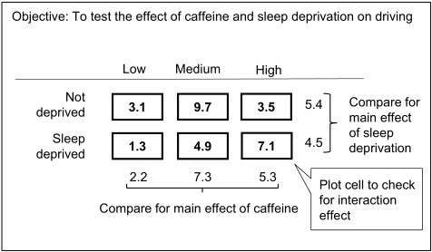

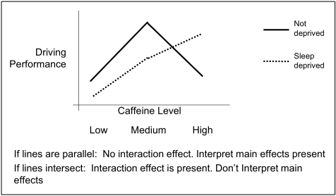

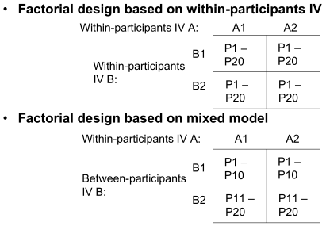

- Strengths
  - Able to manipulate more than one IV simultaneously
  - Able to control confounding variable by including it as an IV
  - Able to study interaction effects on DV
- Weaknesses
  - Number of participants increases with more IV to be tested
  - Difficult to manipulate more than two IV simultaneously
  - High-order interaction effects (e.g. 3-way interaction) are hard to interpret

### Control Techniques At the Start
- Randomization
  - Designed to ensure all comparison groups are equal on all extraneous variables
  - Eliminates systematic bias in the experiment
- Matching
  - Holding variables constant: specify the inclusion criterion for participants (e.g. only females are selected for experiment)
  - Building extraneous variables into research design:  using “blocking”, divide participants into subgroups based on the extraneous variable (e.g. Low IQ scores vs Mid IQ scores vs High IQ scores), IV is created
  - Yoked control :  experimental subject receives response-dependent outcome but control subject receives response-independent outcome
  - Individual matching: subjects are matched on the variables to be controlled (e.g. based on gender, age, IQ).  No new IV is created.

### Counterbalancing
- Introduction
  - Systematic variation of order of experimental conditions in repeated measure design
  - Helps to control sequencing effects: 
    - (1) order effect (error due to the order of conditions), and
    - (2) carryover effect (lingering effects of a previous experimental condition on a current one)

- Randomized counterbalancing
  - Sequence order is randomized for each participant
- Intrasubject counterbalancing
  - Each participant take treatment condition in one order, and then in the reverse order (e.g. in 3-condition design: ABCCBA)
- Complete counterbalancing
  - Identify all possible sequences and then randomly assign subgroups to each sequence (e.g. 1:ABC; 2:ACB; 3: BAC; 4: BCA; 5:CAB; 6:CBA)
- Incomplete counterbalancing
  - Identify fewer than all possible sequences and then randomly assign subgroups to each sequence

### Minimizing Participants Effects
- Double-blind placebo method
  - Both experimenter and participants are unaware which group receives the treatment condition
- Deception
  - Provide false information to all participants about what is being done to control for differential perceptions about the purpose of the study (e.g. Milgram Experiment)
- Insights into participants’ perceptions
  - Retrospective verbal report: asking participants major aspects of the study at the end
  - Concurrent verbal report: (i) sacrifice groups: stopped and interviewed; (ii) concurrent probing: asking during the study; (iii) think- aloud technique: participants verbalize their thoughts and perceptions

### Minimizing Experimenter Effects

- Control of recording errors
  - Use multiple human data recorders; automate data recording
- Control of experimenter attribute errors
  - Avoiding using one experimenter in one condition, and a different experimenter in another condition
- Control of experimenter expectancy error
  - Blind technique: experimenter is completely unaware which group receives treatment
  - Partial blind technique: experimenter is partially aware of the details of the study
  - Automation: reduces or eliminates participant-experimenter interaction

### Participants Recruitment
- Power
  - The probability of rejecting a false-null hypothesis
  - Power increases as the number of participants increases
  - Desirable for the power to be high (ie. At least .80)
- Effect size
  - Magnitude of the relation between IV and DV
- Sample size
  - Number of participants needed
- Alpha level
  - Usually used at 0.05

### Pilot Study
- Definition
  - Run-through of the experiment with a small number of participants
- Purposes
  - Helps indicate whether IV manipulated produced the expected effect
  - Gives researcher the experience with the procedure
  - Identifies subtle factors that can influence the experiment

## 07 - Observational Research

### Qualitative Research Characteristics
- Design strategies
  - Naturalistic inquiry: studying real-world situations; non-manipulative and non-controlling
  - Emergent design flexibility: openness to adapting inquiry as understanding deepens and/or situations change
  - Purposeful sampling: cases are chosen to gain insights into phenomenon, not empirical generalization

- Data-collection and fieldwork strategies
  - Qualitative data: thick description, direct quotes about from people about their perspectives and experiences
  - Personal experience and engagement: researcher has direct contact with the people
  - Empathic neutrality and mindfulness: researcher is empathic and does not pass judgement
  - Dynamic systems: assumes change as an ongoing phenomenon, and thus attentive to system and situation dynamics

- Analysis strategies
  - Unique case orientation: assumes each case to be unique
  - Inductive analysis and creative synthesis: immersion in the details of the data to uncover patterns, themes and relationships; ends with a creative synthesis
  - Holistic perspective: whole phenomenon understand as a complex system; focus on complex interdependencies
  - Context sensitivity: Findings are placed within a unique social, historical and temporal context
  - Voice, perspective and reflexivity: researcher seeks to be balanced in depicting the phenomenon authentically while being self-analytical and politically aware and reflexive

### Qualitative Research Validity
- Descriptive validity
  - Account reported is accurate and factual
  - Employ researcher triangulation to obtain descriptive validity
- Interpretive validity
  - Participants’ subjective viewpoints are portrayed accurately
  - Obtain participant feedback; use low-interference descriptors in the report
- Theoretical validity
  - Theory or explanation fits the data
  - Carry out extended fieldwork (longer time period); triangulate with multiple theories to interpret the data; pattern-matching by testing hypothesis; checking with peers

- Internal validity
  - Focus is on idiographic causation (involving a particular case), rather than nomological causation (relationships among variables)
  - Researcher-as-detective;  methods triangulation; data triangulation
- External validity
  - Focus is on naturalistic generalization
  - Need to include contextual details to enable naturalistic generalization
  - Ultimate goal is to strive for theoretical generalization (main ideas and process observed might be generalized)

### Qualitative Research Methods
- Phenomenology
  - Purpose is to study a person’s or group of individuals’ conscious experience of a phenomenon (e.g. experiences of a WW2 prisoner)
  - Data collected via in-depth interview and open-ended questionnaire
  - Data analyzed by extracting significant phrases verbatim, formulating meanings of the phrases, and organizing them into themes
- Ethnography
  - Purpose is to discover and describe a community in terms of culture, behavior, attitudes and beliefs
  - Needs to gain entry into the community
  - Involves emic perspective (insider) and etic perspective (outsider)
  - Data collected via in-depth interview and participant observation
  - Data analyzed for themes, patterns and meanings

- Case Study
  - Purpose is to describe in detail and analyse one or more cases
  - A case is a bounded system such as a person, group, organization
  - Intrinsic case study:  to describe a particular case, not to generalize
  - Instrumental case study: to shed light on an issue or develop some theoretical explanation
  - Collective case study: to study two or more cases for comparison
  - Data collected via multiple sources such as interviews, questionnaires, documents and archival records
- Grounded Theory
  - Purpose is to generate and develop a theory from empirical data
  - Theory must (I) fit the data, (ii) clarify the phenomenon, (iii) have generality, (iv) be applicable to yield real-world results

### Content Analysis

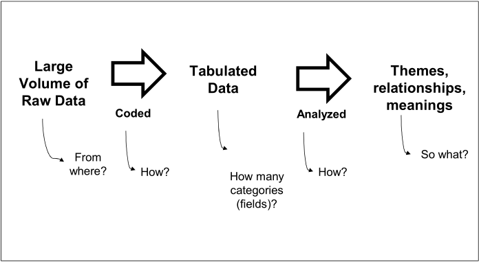

- Definition
  - Systematic summary of qualitative materials presented in books, websites, audio recordings, etc in a quantitative format
- Directed Approach
  - Analysis starts with a theory as guidance for initial codes
- Conventional Approach
  - Coding categories are derived directly from the raw data
- Summative Approach
  - Involves counting and comparisons, (e.g keywords), then interpreting the underlying context

### Steps in Content Analysis
- Data Source Selection
  - Types of medium, criteria for inclusion; date-range, etc
- Unit of Analysis
  - The level at which the chosen content is analyzed (e.g. each social media post, or each sentence in a social media post)
- Categories of analysis
  - The set of variables into which the raw data would be coded
- Coding Scheme
  - The rules to be applied when coding the raw data

## 08 - Interviews and Focus Groups

### Interviews
- Definition
  - A qualitative research technique involving primarily open-ended questions to collect in-depth data
- Purpose
  - To gain insights to the experiences, feelings and perspectives of the participants

### Types of Interviews
- Structured
  - Questions are pre-decided with the intention to maintain uniformity throughout all interview sessions.
- Semi-structured
  - With a basic interview structure, researcher can exercise some flexibility to probe the respondents further with follow-up questions.
- Unstructured
  - Conversation-like. Researcher can approach the respondents in any ethical manner to collect data, keeping in mind the main objective of the research

### Steps involved in Interviews
- Design interview questions
  - Must be guided by the overall research objective
  - Guided by the literature
  - Be mindful of the profile of the target interviewees
- Develop the interview protocol
  - Introduction: yourself and the aim of the interview
  - Body: sequence your questions thematically; confirm your understanding from the interviewees where necessary
  - End: thank the interviewees
- Plan the logistics
  - Location, duration
  - Recording or note-taking

### Focus Groups
- Definition
  - A group interview of carefully selected individuals sharing a common interest or characteristic
- Purpose
  - To gain insight from the discussion among the participants on a topic of interest
- Approach
  - Naturalistic approach, similar to everyday conversation, group dynamics are also captured

## 09 - Data Analysis

### Introduction to Statistics
- Descriptive Statistics
  - Focuses on describing, summarizing or explaining a set of data
  - E.g. Frequency distribution, mean, median, standard deviation
- Inferential Statistics
  - Focuses on making generalizations about a population based on sample data
  - E.g. t-test, ANOVA, ANCOVA, Chi-square test

### Measures of Central Tendency
- Mode
  - The most frequent occurring value in the data set
- Median
  - The center point of a set of ordered data set
  - 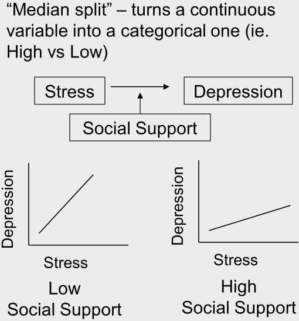
- Mean
  - The arithmetic average of the data set

### Measures of Variability

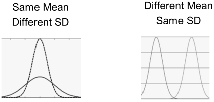

- Range
  - The difference between the maximum and minimum values
- Standard Deviation
  - The magnitude of the dispersion of a set of values

### Distribution

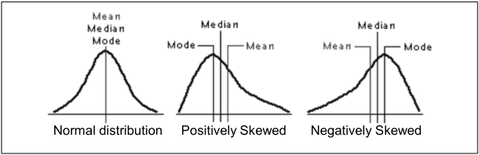

- Normal Distribution
  - Follows the 68, 95, 99.7% rule
  - Examples include height, IQ, rolling of dice, birth weight
- Skewed Distribution
  - Could be positively or negatively skewed

### Relationships Among Variables
- Correlation Coefficient
  - Ranges from -1.00 to 1.00
  - 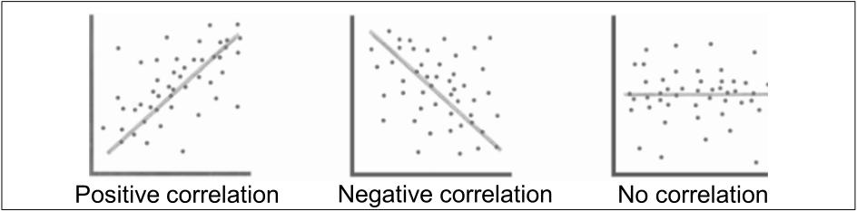
- Partial Correlation Coefficient
  - Ranges from -1.00 to 1.00
  
  - The strength of a relationship between two variables, while controlling for the effect of one or more other variables.
  
  - $$
    \beta_1X+\beta_2Y\rightarrow Z
    $$
  
    

### Descriptive vs Inferential Stats

| Descriptive Statistics                           | Inferential Statistics                              |
| ------------------------------------------------ | --------------------------------------------------- |
| Describes data already collected                 | Extrapolates beyond the data collected              |
| Usually presented as charts, graphs              | Usually presented as probability scores             |
| Use measures of central tendency and variability | Use statistical tools to perform hypothesis testing |

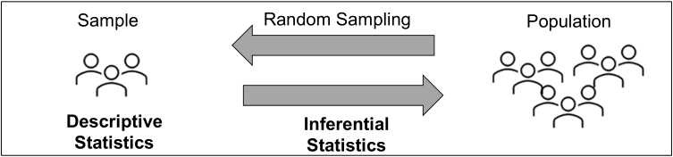

### T-test
- Purpose
  - To determine if there is significant difference between the means of two independent groups
- Example
  - Are NTU students as tall as SMU students?
  - H0: There is no difference between their height
  - Reject H0 if p <0.05
- Assumptions
  - Data are normally distributed
  - Data have equal variances
  - Data are independent

### ANOVA
- Purpose
  - To determine if there is significant difference between the means of three or more independent groups
- Example
  - Do people in Japan, China and India drink the same amount of beer?
  - H0: There is no difference in beer consumption among the countries
  - Reject H0 if p <0.05 (but we still won’t know which regions differ)
- Assumptions
  - Data are normally distributed
  - Data have equal variances
  - Data are independent

### Post-hoc Tests in ANOVA
- Purpose
  - A follow-up of ANOVA to check which pairs of means are significantly different
- Example
  - Use Bonferroni test on: 
    - (i) Japan-China 
    - (ii) Japan-India, and 
    - (iii) China-India
  - Reject H0 in each case if p <0.05

### Repeated Measures ANOVA
- Purpose
  - To determine if there is significant difference among the repeatedly measured means of a same group
- Example
  - How effective is the smoking cessation program among smokers?
  - H0: There is no difference in smoking habits after the program
  - Reject H0  if p <0.05 (but we still won’t know which junctures differ)
- Assumptions
  - Data are normally distributed
  - Data have equal variances
  - Data are independent

### Post-hoc Tests in rm ANOVA
- Purpose
  - A follow-up to check which pairs of means are significantly different
- Example
  - Use Bonferroni test on (i) Pre-Post (ii) Pre-Delayed Post and (iii) Post- Delayed Post
  - Reject H0 in each case if p <0.05

### ANCOVA
- Purpose
  - To test for the effect of categorical variables on a continuous dependent variable, controlling for covariates.
- Example
  - Is there a difference in the 2.4km run timing between athletes who are given the energy bar and those who drink only water?
  - H0: There is no difference in post-test means for both groups
  - Reject H0  if p <0.05 (ie. Treatment has been effective)
- Assumptions
  - Data are normally distributed
  - Data have equal variances
  - Data are independent

### 2-Way ANOVA
- Purpose
  - To determine how two categorical independent variables, in combination, affect a quantitative dependent variable
- Example
  - How do intensity (high vs low) and time of exercise (morning vs evening) affect sleep (in hours)?
  - H0: Intensity does not interact with time of exercise in affecting sleep
  - Reject H0  if p <0.05
- Assumptions
  - Data are normally distributed
  - Data have equal variances
  - Data are independent

- 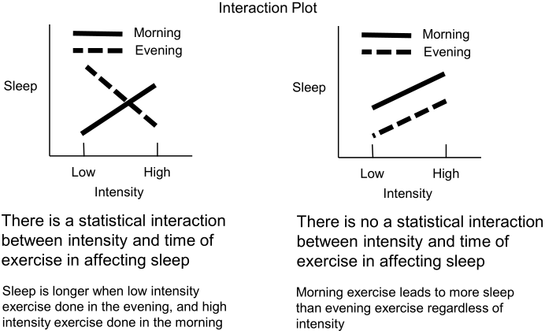

### Multiple Regression
- Purpose
  - To determine how two or more quantitative independent variables, in combination, affect a quantitative dependent variable
- Example
  - How do job satisfaction (JS) and organizational commitment (OC) affect turnover intention?
  - H0: JS and OC do not affect turnover intention
  - Reject H0  if p <0.05
- Assumptions
  - (1) No or little multicollinearity; 
  - (2) Linear relationship; 
  - (3) Multivariate normality; 
  - (4) No auto- correlation (residuals are independent); 
  - (5) Homoscedasticity (residuals are equal across regression line).

- Interpreting Results
  - p value in the ANOVA Table: statistical significance of the model
  - R-square value in the Model Summary Table: robustness of the model
  - Beta-coefficients in the Coefficients Table: contribution from each independent variable (polarity denotes direction of association)
  - VIF in the Coefficients Table: used to rule out multicollinearity

### Chi-Square Test
- Purpose
  - To determine if there is a relationship between categorical variables
- Example
  - Is gender (male vs female) related to the preference for reading medium (print vs online)?
  - H0: Gender and preference for reading medium are not related
  - Reject H0  if p <0.05
- Assumptions
  - Data are categorical
  - Independence of observation

## 10 - Research Ethics

### Areas of Ethical Concerns
- Relationship between Society and Science
  - Research caught between the funder’s interests and those of science
  - E.g. drug companies sponsoring research to boost sales rather than to improve drugs
- Professional Issues
  - Research misconduct covers fabrication, falsification, plagiarism  in proposing, performing, reviewing or reporting research
  - IRB is instituted as a strategy to minimize research misconduct
- Treatment of Research Participants
  - Participants must be protected from physical and psychological harm

### Ethical Guidelines
- Beneficence and nonmaleficence
  - Beneficence: doing good for others
  - Nonmaleficence: doing no harm to others
  - IRB review categories:
- Exempt (no known risk)
- Expedited (no more than minimal risk)
- Full (more than minimal risk)
- Fidelity and Responsibility
  - Safeguards must be incorporated to help maintain a trusting relationship between researcher and participants
- Integrity
  - Researchers must be honest, accurate and truthful

- Justice
  - Research participants ought to receive equal benefits
- Respect for People’s Rights and Dignity
  - Everyone has the right of privacy, confidentiality and self- determination
  - Obtain informed consent before carrying the research

### Ethical Issues in Research
- Institutional Approval
  - Institutional Review Board (IRB)’s approval is needed before research can be conducted
- Informed Consent
  - Informed consent refers to fully informing participants about all aspects of the study
  - Informed consent could be waived if signing the form identifies the participants to the research, and research present no more than minimal risk to participant
  - Passive consent: parents or guardians give consent by not returning the consent form

- Deception
  - Active deception: researcher deliberately mislead by giving false information
  - Passive deception: researcher withhold certain information from participants
- Debriefing
  - Debriefing: post-experimental discussion about the study’s purpose and details
  - Dehoaxing: debriefing about any deception used in the experiment
  - Desensitizing: eliminating any undesirable influence the experiment might have had on the participants

- Coercion and Freedom to Decline Participation
  - Researchers should not exploit people over whom they have authority
- Confidentiality, Anonymity and Privacy
  - Confidentiality: Not revealing information collected from participants to anyone outside the research group
  - Anonymity: keeping the identity of participants unknown
  - Privacy: having control of access to information about you
- Internet Research
  - Informed consent can be accompanied by a link to FAQs.
  - Participant’s email addresses can be collected for debriefing purposes

